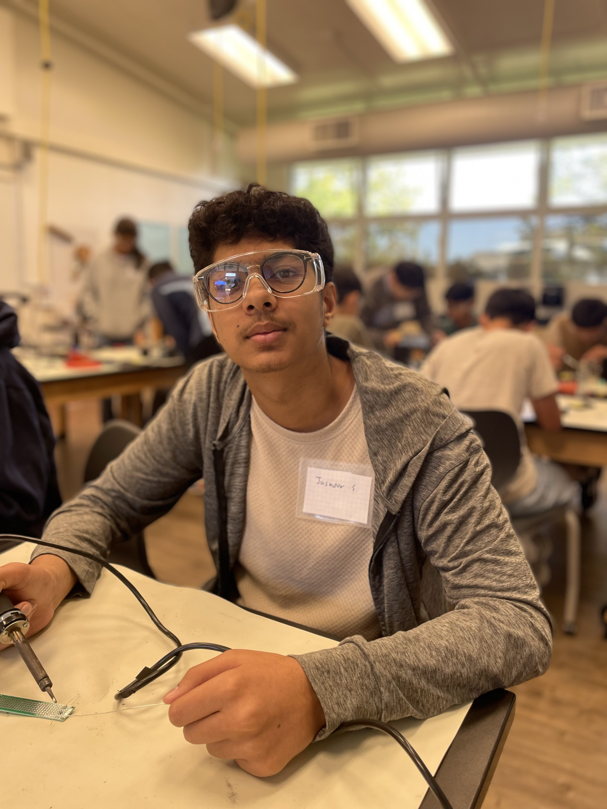
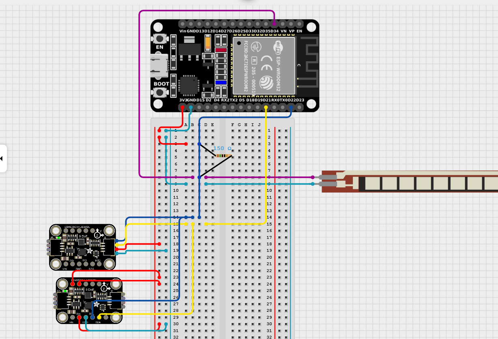
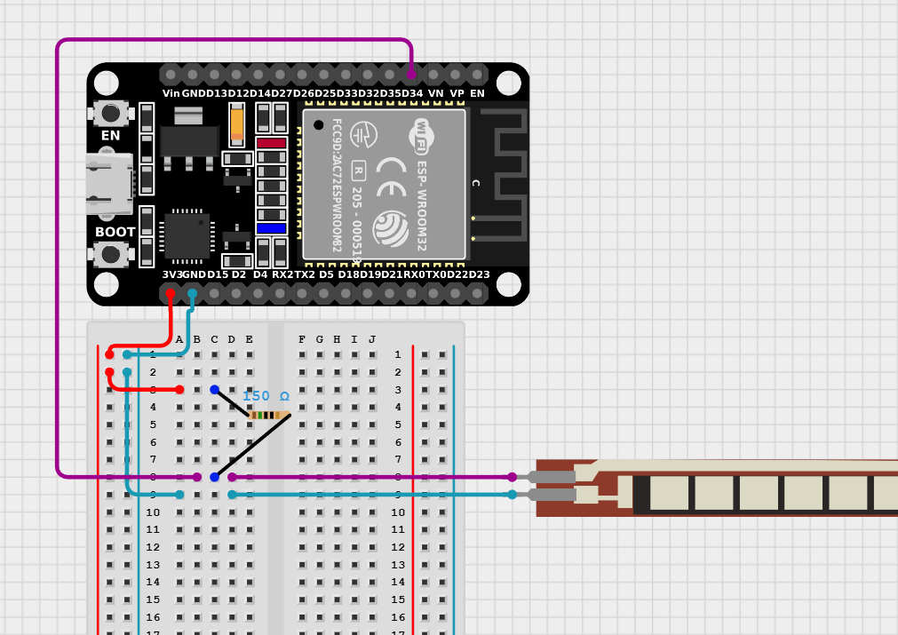
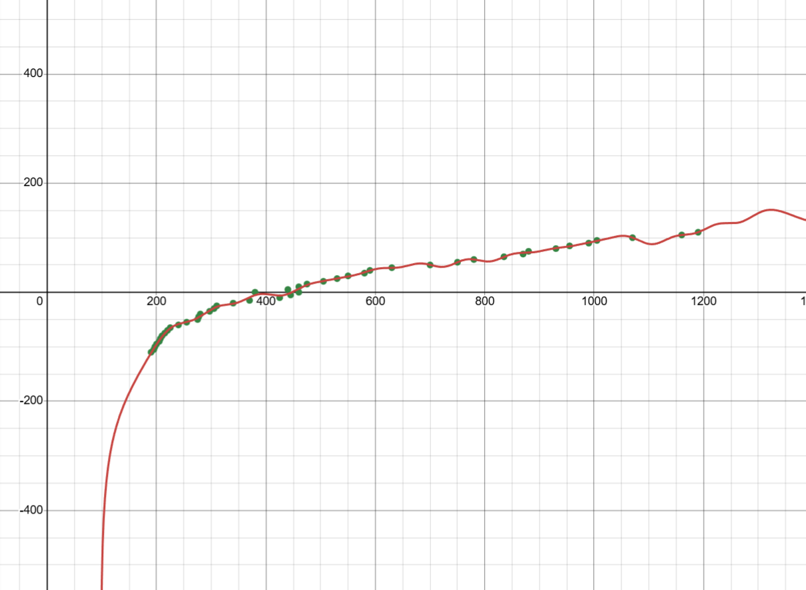
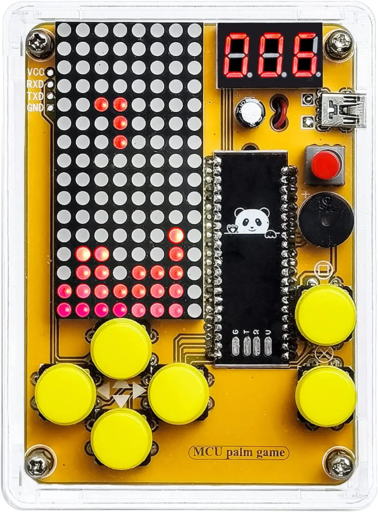

<!--

# Wrist Rehabilitation Device
Replace this text with a brief description (2-3 sentences) of your project. This description should draw the reader in and pique their interest in what you've built. You can include what the biggest challenges, takeaways, and triumphs from completing the project were. As you complete your portfolio, remember your audience is less familiar than you are with all that your project entails!
You should comment out all portions of your portfolio that you have not completed yet, as well as any instructions:
```HTML 
This is an HTML comment in Markdown
Anything between these symbols will not render on the published site
```


| Jas S. | Basis Independent Fremont | Mechanical Engineering | Incoming Junior|


**Replace the BlueStamp logo below with an image of yourself and your completed project. Follow the guide [here](https://tomcam.github.io/least-github-pages/adding-images-github-pages-site.html) if you need help.**

-->



<!--

# Final Milestone


**Don't forget to replace the text below with the embedding for your milestone video. Go to YouTube, click Share -> Embed, and copy and paste the code to replace what's below.**

<iframe width="560" height="315" src="https://www.youtube.com/embed/F7M7imOVGug" title="YouTube video player" frameborder="0" allow="accelerometer; autoplay; clipboard-write; encrypted-media; gyroscope; picture-in-picture; web-share" allowfullscreen></iframe>

For your final milestone, explain the outcome of your project. Key details to include are:
- What you've accomplished since your previous milestone
- What were your biggest challenges and triumphs at BSE
- A summary of key topics you learned about
- What do you hope to learn in the future after everything you've learned at BSE


-->

# Second Milestone

<iframe width="560" height="315" src="https://www.youtube.com/embed/y3VAmNlER5Y" title="YouTube video player" frameborder="0" allow="accelerometer; autoplay; clipboard-write; encrypted-media; gyroscope; picture-in-picture; web-share" allowfullscreen></iframe>

<figure>
  
  <figcaption> This is an image of my circuit so far.</figcaption><br/>
 
</figure>

**Description:**
I have installed two 9-axis IMUs. One was installed at the side of the hand, and one was installed at the side of the forearm. I did this to be able to differentiate linear movement from wrist movement. If there was a difference between the two sensors, they would need to have moved their wrist, and if not, they just moved their arm along. I wanted to ensure that the data was easily accessible. I began searching for options to create a website. I found a website that would be able to do that called adafruit.io. I made the website include an output for each value with timestamps and a light that detects if the user is bending their wrist at a bad angle or not. I will also eventually add the vibration sensors to help people use it without the website. The website will only be used for long-term data collection and the identification of long-term improvement. I made the website public, making it so anyone can access it with the link and see the data.

**Challenges:**
When installing the IMUs, I had to find a way to differentiate the two sensors' data from each other. TO do this, I had them both go into the same port with different filters and variables. Whenever I would send data to the website, it would exceed the limit for how much data could be processed. Due to this, Adafruit IO would ban me for a short period of time. To solve this, I used millis(), which counts how much time has elapsed since the code started running. By doing this, I was able to identify how to make it use the most amount of data I could without getting banned. I made it so that the data sends every 12 seconds to the website. This was alright because it is only for long-term data tracking, while the buzzers and vibrators help with short-term and immediately alerting the user.

**Next Steps:**
I need to still add the vibration and speakers to alert the user, sew it all onto the glove, solder it all onto the final breadboard, and also finish the modifications.

# First Milestone

<iframe width="560" height="315" src="https://www.youtube.com/embed/fmthsALyXC0?si=sA5ARxU7Pw9Ax2rS" title="YouTube video player" frameborder="0" allow="accelerometer; autoplay; clipboard-write; encrypted-media; gyroscope; picture-in-picture; web-share" referrerpolicy="strict-origin-when-cross-origin" allowfullscreen></iframe>


**Description:**

My first milestone was to be able to accurately receive data from the flex sensor with high accuracy. For example, I had to find the angle of the bend in the flex sensor:

<figure>
  
  <figcaption>This is an image of my circuit so far.</figcaption>
</figure>

So far, I've understood how the flex sensor works and how the accelerometer works. However, I've only identified how to use the flex sensor and receive an accurate angle. To do that, I plotted the data I received from bending the flex sensor at a certain angle. Below is the function and graph that I created from the data:

<figure>
  
  <figcaption>This is my graph of data received on the X-axis and the angle on the Y-axis.</figcaption>
</figure>

$y = m * (a * x - b) + \sum_{i=1}^8 ci * cos(fi * x + pi)$

This equation is made by taking the base equation and using the cosine to fit the data more accurately. We use cosine because in the data it makes the shape of a cosine curve. I used this equation so that the graph would fit my data very tightly. This makes it so that I have a 99.85% accuracy relative to my data. This means that it isn't 99.85% accurate to the actual angle, but rather the angles that I measured. I did this because I was pretty confident with my measurements, as I took around 50 measurements.

**Challenges:**
Some challenges I faced were identifying how to make an equation that matches it. Once I learned about using C * cos (f * x + p), I added more until the accuracy reached its highest. Another challenge I faced was when taking measurements, the sensor would return values that don't make any sense, that are way too high ot low. To solve this, I took many measurements to reduce experimental error. I also took the average of the last ten values when writing the code to exclude outliers and make it more accurate.

**Next Steps:**
Next, I want to find a way to use the accelerometers to identify the angles between them. Then, I would like to transfer the data from both sensors via Wifi.


# Starter Project - Retro Arcade Console

<iframe width="560" height="315" src="https://www.youtube.com/embed/HoTiaGMx5EQ?si=7KrHkXm_49cLGxsC" title="YouTube video player" frameborder="0" allow="accelerometer; autoplay; clipboard-write; encrypted-media; gyroscope; picture-in-picture; web-share" referrerpolicy="strict-origin-when-cross-origin" allowfullscreen></iframe>

<figure>
  
  <figcaption>This is an image of an example retro arcade console.</figcaption>
</figure>

**Description:**
In the starter project, I created a retro arcade console. First, I soldered on the LED displays, which would be the screen and score display. Then, I soldered the USB port to be able to change the data in the microcontroller. Then, I soldered on the buttons for input. Next, I attached the battery pack to the back case, trimmed the wires, and attached the wires to allow for power. I added the capacitor and cut off the extra metal since it stuck out very far. The switch was placed between the power and the rest of the circuit to be able ot turn the power on and off. Finally, I added a vibrator to add a new effect. When creating this project, I learned how to sauter, desauter, and splice wires.

**Challenges:**
My biggest challenge was that I had to restart the starter project twice. The first time I accidentally melted the switch with the soldering gun while working on soldering the wires. The switch was already soldered on the board and wouldn't budge even after desoldering. The second time, I had placed the displays upside down,n and so the polarity of the displays got messed up. The displays also wouldn't get desoldered after an hour of trying. On the third attempt, I finally finished the project.

**Next Steps:**
My next steps will be to understand how the parts for my main project work and how I can use them to make my wrist rehabilitation device. Then, I will have to find a way to accurately measure the angle of the device.

<!-- 

# Code
Here's where you'll put your code. The syntax below places it into a block of code. Follow the guide [here]([url](https://www.markdownguide.org/extended-syntax/)) to learn how to customize it to your project needs. 

```c++
void setup() {
  // put your setup code here, to run once:
  Serial.begin(9600);
  Serial.println("Hello World!");
}

void loop() {
  // put your main code here, to run repeatedly:

}
```

# Bill of Materials
Here's where you'll list the parts in your project. To add more rows, just copy and paste the example rows below.
Don't forget to place the link of where to buy each component inside the quotation marks in the corresponding row after href =. Follow the guide [here]([url](https://www.markdownguide.org/extended-syntax/)) to learn how to customize this to your project needs. 

| **Part** | **Note** | **Price** | **Link** |
|:--:|:--:|:--:|:--:|
| Item Name | What the item is used for | $Price | <a href="https://www.amazon.com/Arduino-A000066-ARDUINO-UNO-R3/dp/B008GRTSV6/"> Link </a> |
| Item Name | What the item is used for | $Price | <a href="https://www.amazon.com/Arduino-A000066-ARDUINO-UNO-R3/dp/B008GRTSV6/"> Link </a> |
| Item Name | What the item is used for | $Price | <a href="https://www.amazon.com/Arduino-A000066-ARDUINO-UNO-R3/dp/B008GRTSV6/"> Link </a> |

# Other Resources/Examples
One of the best parts about GitHub is that you can view how other people set up their work. Here are some past BSE portfolios that are awesome examples. You can view how they set up their portfolio, and you can view their index.MD files to understand how they implemented different portfolio components.
- [Example 1](https://trashytuber.github.io/YimingJiaBlueStamp/)
- [Example 2](https://sviatil0.github.io/Sviatoslav_BSE/)
- [Example 3](https://arneshkumar.github.io/arneshbluestamp/)

To watch the BSE tutorial on how to create a portfolio, click here.

-->


